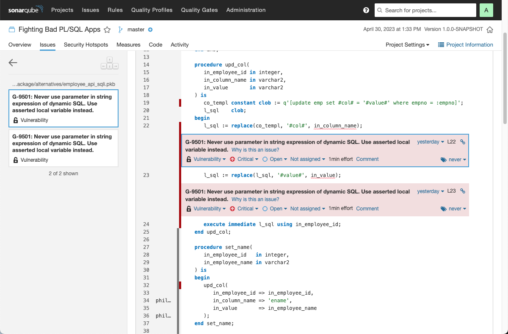

# Fighting Bad Database Apps

## Introduction

This repository contains the example used in the presentation [Fighting Bad Database Apps](https://www.salvis.com/blog/talks/). The examples require an [Oracle Database](https://www.oracle.com/database/technologies/free-downloads.html) 19c or newer with an installed [utPLSQL](https://github.com/utPLSQL/utPLSQL) framework v3.1.13 or newer.

## Demo App

The demo application in folder src/main contains a [PinkDB](https://www.salvis.com/blog/2018/07/18/the-pink-database-paradigm-pinkdb/) application based on Oracle's dept/emp example. In this folder the following Oracle Database users are managed:

| User | Description | Used in Production? |
| ---- | ----------- | ------------------- |
| `developer` | Personal user. Used for development. | No |
| `app_tester` | Technical user. Used by utPLSQL-cli. | No |
| `app_connect` | Technical user. Used to by the front-end application/middle tier to connect. | Yes |
| `app` | Schema-only account. Owns the data and the API. Proxy connection allowed via `developer` and `app_tester`. | Yes |

To install the application run [install.sql](install.sql) when connected as an Oracle user with `dba` privileges (e.g. `sys`, `system`, `pdbadmin`). The script is [idempondent](https://en.wikipedia.org/wiki/Idempotence). utPLSQL tests are also installed, unless the database instance is named `PROD`. 

## PinkDB and PoLP Tests

The folder src/test contains utPLSQL tests. In addition to the functional tests, there is a test suite named [test_pinkdb](src/test/app/package/test_pinkdb.pks) that validates the following features of a [PinkDB](https://www.salvis.com/blog/2018/07/18/the-pink-database-paradigm-pinkdb/) application:

| Feature | Test | Notes |
| ------- | ---- | ----- |
| 1. Connect user does not own database objects. | `connect_user_objects` | No exceptions. |
| 2. The connect user has access to API objects only. | `connect_user_privileges` | Only `CREATE SESSION` and `API_ROLE` allowed. |
| | `connect_direct_object_privs` | No directly granted objects allowed (access is granted via `API_ROLE`). |
| 3. The API consists of stored objects and views | `api_role_object_privs` | Tables are not part of the API and objects granted to `API_ROLE` must be owned by `APP`. |

In addition, the `app_schema_privileges` test verfies that the [Principle of Least Privileges (PoLP)](https://en.wikipedia.org/wiki/Principle_of_least_privilege) is followed for the `app` schema. The following privileges are allowed:

| Privilege               | Used in Production? | At Runtime? |
| ----------------------- | ------------------- | ----------- |
| `CREATE SESSION`        | Yes | No |
| `CREATE TABLE`          | Yes | No |
| `CREATE VIEW`           | Yes | No |
| `CREATE PROCEDURE`      | Yes | No |
| `CREATE PUBLIC SYNONYM` | Yes | No |
| `DROP PUBLIC SYNONYM`   | Yes | No |
| `SELECT ANY DICTIONARY` | No  | No |
| `DEBUG CONNECT SESSION` | No  | No |
| `DEBUG ANY PROCEDURE`   | No  | No |

Some privileges are required only in development and test environments. And all of them are required at install time only. This means after a successful installation of the application all privileges of the `app` schema can be revoked. This can be done with the [lockdown.sql](lockdown.sql) script, that removes everything that is not required to run the app in production.

## SQL Injection Tests

There are tests to check whether the `employee_api.set_job` procedure is vulnerable to SQL injection. See the following two tests in [test_employee_api](src/test/app/package/test_employee_api.pks):

- `set_job_try_sqli`
- `set_job_try_sqli_too_long`

Another way to detect SQL injection vulnerarbilities is to use static code analysis. For example the [SQLInjection validator](https://github.com/Trivadis/plsql-cop-validators#sqlinjection) is part of the composite validator TrivadisGuidelines3Plus	and can be used in [db* CODECOP CLI](https://github.com/Trivadis/plsql-cop-validators#use-in-db-codecop), [SQL Developer](https://github.com/Trivadis/plsql-cop-validators#use-in-db-codecop-for-sql-developer) or [SonarQube](https://github.com/Trivadis/plsql-cop-validators#use-in-db-codecop-for-sonarqube).

## Bad Stuff

All utPLSQL tests should complete successfully after the installation via [install.sql](install.sql). You can change that by installing some bad stuff via [install_bad_stuff.sql](install_bad_stuff.sql) as an Oracle DBA. 

After installing the bad stuff you can connect as `developer[app]` and run the following:

```sql
set serveroutput on size unlimited
execute ut.run;
```

The expected server output should look similar to the following:

```
app
  pinkdb
    test_pinkdb
      app_schema_privileges [.264 sec] (FAILED - 1)
      connect_user_privileges [.267 sec] (FAILED - 2)
      connect_user_objects [.03 sec] (FAILED - 3)
      connect_direct_object_privs [.031 sec] (FAILED - 4)
      api_role_object_privs [.018 sec] (FAILED - 5)
  api
    view
      test_employees
        initial_data [0 sec]
        new_emp [.016 sec]
      test_departements
        initial_data [.016 sec]
        new_dept [0 sec]
      test_departement_salaries
        initial_data [.015 sec]
        new_dept_and_emps [.016 sec]
    pkg
      test_employee_api
        ins [.016 sec]
        upd
          set_name [.018 sec]
          job
            set_job [.028 sec]
            set_job_too_long [.016 sec]
            set_job_try_sqli [.047 sec] (FAILED - 6)
            set_job_try_sqli_too_long [.047 sec] (FAILED - 7)
          set_hiredate [.015 sec]
          set_department [.016 sec]
          set_manager [.031 sec]
          set_salary [.017 sec]
          set_commission [.018 sec]
        del [.014 sec]
      test_departement_api
        ins [.016 sec]
        upd [.031 sec]
        del [0 sec]
 
Failures:
 
  1) app_schema_privileges
      Actual: refcursor [ count = 10 ] was expected to equal: refcursor [ count = 9 ]
      Diff:
      Rows: [ 1 differences ]
      Extra:    <PRIV>SELECT ANY TABLE</PRIV>
      at "APP.TEST_PINKDB.APP_SCHEMA_PRIVILEGES", line 140 ut.expect(c_actual).to_equal(c_expected).unordered;
       
  2) connect_user_privileges
      Actual: refcursor [ count = 241 ] was expected to equal: refcursor [ count = 2 ]
      Diff:
      Rows: [ 239 differences, showing first 20 ]
      Extra:    <PRIV>CREATE SEQUENCE</PRIV>
      Extra:    <PRIV>COMMENT ANY MINING MODEL</PRIV>
      Extra:    <PRIV>CHANGE NOTIFICATION</PRIV>
      Extra:    <PRIV>CREATE JOB</PRIV>
      Extra:    <PRIV>DROP ANY ATTRIBUTE DIMENSION</PRIV>
      Extra:    <PRIV>EXECUTE ANY PROGRAM</PRIV>
      Extra:    <PRIV>DROP ANY SYNONYM</PRIV>
      Extra:    <PRIV>DROP USER</PRIV>
      Extra:    <PRIV>ADMINISTER SQL MANAGEMENT OBJECT</PRIV>
      Extra:    <PRIV>DROP ANY SEQUENCE</PRIV>
      Extra:    <PRIV>CREATE ANY CUBE BUILD PROCESS</PRIV>
      Extra:    <PRIV>EXECUTE ANY CLASS</PRIV>
      Extra:    <PRIV>EXPORT FULL DATABASE</PRIV>
      Extra:    <PRIV>CREATE CUBE</PRIV>
      Extra:    <PRIV>DROP ANY DIMENSION</PRIV>
      Extra:    <PRIV>ALTER ANY OPERATOR</PRIV>
      Extra:    <PRIV>CREATE CLUSTER</PRIV>
      Extra:    <PRIV>DROP LOGICAL PARTITION TRACKING</PRIV>
      Extra:    <PRIV>DELETE ANY MEASURE FOLDER</PRIV>
      Extra:    <PRIV>CREATE MEASURE FOLDER</PRIV>
      at "APP.TEST_PINKDB.CONNECT_USER_PRIVILEGES", line 160 ut.expect(c_actual).to_equal(c_expected).unordered;
       
  3) connect_user_objects
      Actual: refcursor [ count = 1 ] was expected to equal: refcursor [ count = 0 ]
      Diff:
      Rows: [ 1 differences ]
        Row No. 1 - Extra:    <OBJECT_TYPE>TABLE</OBJECT_TYPE><OBJECT_NAME>EMP</OBJECT_NAME>
      at "APP.TEST_PINKDB.CONNECT_USER_OBJECTS", line 182 ut.expect(c_actual).to_equal(c_expected);
       
  4) connect_direct_object_privs
      Actual: refcursor [ count = 13 ] was expected to equal: refcursor [ count = 0 ]
      Diff:
      Rows: [ 13 differences ]
        Row No. 1 - Extra:    <OWNER>APP</OWNER><TYPE>TABLE</TYPE><NAME>EMP</NAME><PRIVILEGE>ALTER</PRIVILEGE>
        Row No. 2 - Extra:    <OWNER>APP</OWNER><TYPE>TABLE</TYPE><NAME>EMP</NAME><PRIVILEGE>DEBUG</PRIVILEGE>
        Row No. 3 - Extra:    <OWNER>APP</OWNER><TYPE>TABLE</TYPE><NAME>EMP</NAME><PRIVILEGE>DELETE</PRIVILEGE>
        Row No. 4 - Extra:    <OWNER>APP</OWNER><TYPE>TABLE</TYPE><NAME>EMP</NAME><PRIVILEGE>FLASHBACK</PRIVILEGE>
        Row No. 5 - Extra:    <OWNER>APP</OWNER><TYPE>TABLE</TYPE><NAME>EMP</NAME><PRIVILEGE>INDEX</PRIVILEGE>
        Row No. 6 - Extra:    <OWNER>APP</OWNER><TYPE>TABLE</TYPE><NAME>EMP</NAME><PRIVILEGE>INSERT</PRIVILEGE>
        Row No. 7 - Extra:    <OWNER>APP</OWNER><TYPE>TABLE</TYPE><NAME>EMP</NAME><PRIVILEGE>ON COMMIT REFRESH</PRIVILEGE>
        Row No. 8 - Extra:    <OWNER>APP</OWNER><TYPE>TABLE</TYPE><NAME>EMP</NAME><PRIVILEGE>QUERY REWRITE</PRIVILEGE>
        Row No. 9 - Extra:    <OWNER>APP</OWNER><TYPE>TABLE</TYPE><NAME>EMP</NAME><PRIVILEGE>READ</PRIVILEGE>
        Row No. 10 - Extra:    <OWNER>APP</OWNER><TYPE>TABLE</TYPE><NAME>EMP</NAME><PRIVILEGE>REFERENCES</PRIVILEGE>
        Row No. 11 - Extra:    <OWNER>APP</OWNER><TYPE>TABLE</TYPE><NAME>EMP</NAME><PRIVILEGE>SELECT</PRIVILEGE>
        Row No. 12 - Extra:    <OWNER>APP</OWNER><TYPE>TABLE</TYPE><NAME>EMP</NAME><PRIVILEGE>UPDATE</PRIVILEGE>
        Row No. 13 - Extra:    <OWNER>SYS</OWNER><TYPE>PACKAGE</TYPE><NAME>DBMS_SYS_SQL</NAME><PRIVILEGE>EXECUTE</PRIVILEGE>
      at "APP.TEST_PINKDB.CONNECT_DIRECT_OBJECT_PRIVS", line 204 ut.expect(c_actual).to_equal(c_expected);
       
  5) api_role_object_privs
      Actual: refcursor [ count = 11 ] was expected to equal: refcursor [ count = 0 ]
      Diff:
      Rows: [ 11 differences ]
        Row No. 1 - Extra:    <OWNER>APP</OWNER><TYPE>TABLE</TYPE><NAME>DEPT</NAME><PRIVILEGE>ALTER</PRIVILEGE>
        Row No. 2 - Extra:    <OWNER>APP</OWNER><TYPE>TABLE</TYPE><NAME>DEPT</NAME><PRIVILEGE>DEBUG</PRIVILEGE>
        Row No. 3 - Extra:    <OWNER>APP</OWNER><TYPE>TABLE</TYPE><NAME>DEPT</NAME><PRIVILEGE>DELETE</PRIVILEGE>
        Row No. 4 - Extra:    <OWNER>APP</OWNER><TYPE>TABLE</TYPE><NAME>DEPT</NAME><PRIVILEGE>FLASHBACK</PRIVILEGE>
        Row No. 5 - Extra:    <OWNER>APP</OWNER><TYPE>TABLE</TYPE><NAME>DEPT</NAME><PRIVILEGE>INSERT</PRIVILEGE>
        Row No. 6 - Extra:    <OWNER>APP</OWNER><TYPE>TABLE</TYPE><NAME>DEPT</NAME><PRIVILEGE>ON COMMIT REFRESH</PRIVILEGE>
        Row No. 7 - Extra:    <OWNER>APP</OWNER><TYPE>TABLE</TYPE><NAME>DEPT</NAME><PRIVILEGE>QUERY REWRITE</PRIVILEGE>
        Row No. 8 - Extra:    <OWNER>APP</OWNER><TYPE>TABLE</TYPE><NAME>DEPT</NAME><PRIVILEGE>READ</PRIVILEGE>
        Row No. 9 - Extra:    <OWNER>APP</OWNER><TYPE>TABLE</TYPE><NAME>DEPT</NAME><PRIVILEGE>SELECT</PRIVILEGE>
        Row No. 10 - Extra:    <OWNER>APP</OWNER><TYPE>TABLE</TYPE><NAME>DEPT</NAME><PRIVILEGE>UPDATE</PRIVILEGE>
        Row No. 11 - Extra:    <OWNER>SYS</OWNER><TYPE>PACKAGE</TYPE><NAME>DBMS_SYS_SQL</NAME><PRIVILEGE>EXECUTE</PRIVILEGE>
      at "APP.TEST_PINKDB.API_ROLE_OBJECT_PRIVS", line 228 ut.expect(c_actual).to_equal(c_expected);
       
  6) set_job_try_sqli
      Actual: refcursor [ count = 1 ] was expected to equal: refcursor [ count = 1 ]
      Diff:
      Rows: [ 1 differences ]
        Row No. 1 - Actual:   <JOB>S</JOB><SAL>9</SAL>
        Row No. 1 - Expected: <JOB>S&apos;,sal=&apos;9</JOB><SAL>4700</SAL>
      at "APP.TEST_EMPLOYEE_API.SET_JOB_TRY_SQLI", line 114 ut.expect(c_actual).to_equal(c_expected);
       
  7) set_job_try_sqli_too_long
      Actual: refcursor [ count = 1 ] was expected to equal: refcursor [ count = 1 ]
      Diff:
      Rows: [ 1 differences ]
        Row No. 1 - Actual:   <JOB>SALESMAN</JOB><SAL>9000</SAL>
        Row No. 1 - Expected: <JOB>ANALYST</JOB><SAL>3000</SAL>
      at "APP.TEST_EMPLOYEE_API.SET_JOB_TRY_SQLI_TOO_LONG", line 136 ut.expect(c_actual).to_equal(c_expected);
       
      Runtime exception expected.
      at "APP.TEST_EMPLOYEE_API.SET_JOB_TRY_SQLI_TOO_LONG", line 143 ut.fail('Runtime exception expected.');
       
      Expected one of exceptions (-6502, -12899) but nothing was raised.
       
Finished in 1.061 seconds
26 tests, 7 failed, 0 errored, 0 disabled, 0 warning(s)
 


PL/SQL procedure successfully completed.
```

The SQL injection vulnerabilities are also detected via db* CODECOP. Here's a screenshot from SonarQube:



You can fix just this SQL injection vulnerability by installing [employee_api_sqli_fixed.pkb](src/main/app/package/alternatives/employee_api_sqli_fixed.pkb). It's a minimal fix. However, I consider the [original package body](src/main/app/package/employee_api.pkb) better, since it does not use dynamic SQL.

Run [uninstall_bad_stuff.sql](uninstall_bad_stuff.sql) to fix all issues.
